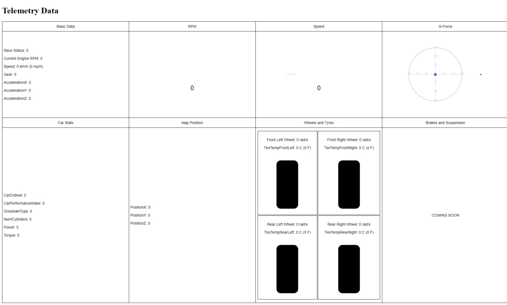

# Forza Motorsports 2023 Telemetry Data Dashboard

**Project name:** super-duper-system

Forza Motorsports 2023 Telemetry Data Dashboard



This repository contains Python and HTML code to create a telemetry data dashboard for Forza Motorsport 2023 using Flask and Socket.IO for real-time updates. The dashboard displays various telemetry data such as RPM, speed, G-forces, and car stats.

## Prerequisites

Before running the code, ensure you have the following prerequisites installed:

- Python
- Flask
- Flask-SocketIO
- D3.js

You can install the required Python packages using pip:

```
pip install Flask flask-socketio
```

Or you can run:

```
pip install -r requirements.txt
```

## Running the Application

1. Clone this repository to your local machine:

```
git clone https://github.com/andrewzaia/super-duper-system.git
```

2. Navigate to the project directory:

```
cd super-duper-system
```

3. Run the Python application to start the server:

```
python app.py
```

This will start the Flask server and the UDP listener for telemetry data.

4. Access the dashboard in your web browser by navigating to `http://localhost:8080`.

## Understanding the Code

### Python Code (app.py)

- This Python code sets up a Flask web application and a Socket.IO server for real-time communication.

- Telemetry data is received via UDP packets and unpacked according to the Forza Motorsport 2023 structure.

- The data is updated in a dictionary called telemetry_data, and real-time updates are sent to connected clients via WebSocket.

- The main functionality is executed when the Python script is run, and the server is started on port 8080.

### HTML Code (index.html)

- The HTML code defines the structure of the telemetry data dashboard.

- It uses JavaScript, D3.js, and Socket.IO to dynamically update the data in real-time.

- Telemetry data is displayed in tables and various visual elements, including circular gauges for RPM and speed, and a graphical representation of G-forces.

- The HTML file establishes a WebSocket connection to the server and listens for telemetry data updates.

### Text File (forza.txt)

The forza.txt file contains a list of available references from the data output received through telemetry. This file defines the structure of the telemetry data and provides the byte offsets for each data element. For example:

- S32 IsRaceOn; 0
- U32 TimestampMS; 4
- F32 EngineMaxRpm; 8
- F32 EngineIdleRpm; 12
- F32 CurrentEngineRpm; 16

This is only included to refer to the relevant bytes when required. I found this was much easier to comprehend than the offical notes.

Link: https://support.forzamotorsport.net/hc/en-us/articles/21742934024211-Forza-Motorsport-Data-Out-Documentation

## ToDo

- Map out the positional X, Y and Z on to a 3D map - a bit out of my league at the moment
- Visual improvements
- Create a generic overlay for Forza streamers to show aspects of the stats universally across all vehicles
- combine it all into a cute little executable file for official release

## Acknowledgments
This code is a simple telemetry data dashboard example. You can customize and expand it to meet your specific requirements and integrate it with your racing simulation game.

Enjoy monitoring your racing performance in real-time!